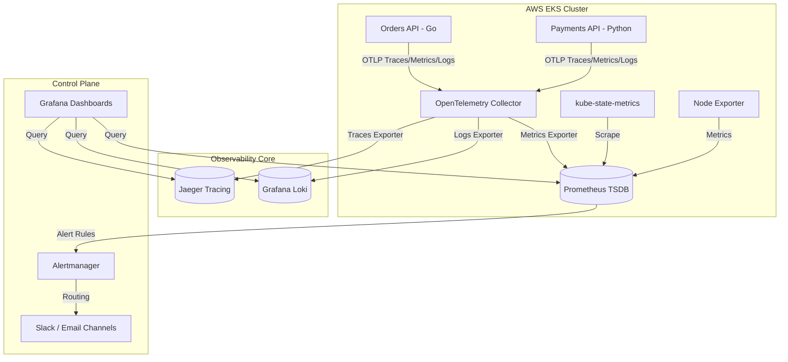

# Enterprise SRE & Multi-Pillar Observability Platform

A production-ready, enterprise-grade Site Reliability Engineering (SRE) and Observability platform deployed on AWS Elastic Kubernetes Service (EKS). This platform transitions operations from traditional reactive monitoring to proactive reliability engineering by implementing vendor-agnostic data collection via **OpenTelemetry (OTel)**, automated SLI/SLO tracking, and GitOps-driven infrastructure lifecycle management.

---

## 🏗️ System Architecture & Data Flow

The platform centralizes infrastructure, container, and application lifecycle data through an OpenTelemetry unified collection pipeline, routing metrics, logs, and traces to decoupled storage backends.



---

## 🛠️ Core Engineering Features

### 1. Infrastructure & Kubernetes Capacity Monitoring

* **Node Observability:** Tracking Node CPU Utilization, Memory Saturation, Disk IOPS/Throughput, Network Packets/Errors, and Filesystem consumption via `Node Exporter`.
* **Cluster Orchestration Health:** Continuous monitoring of Pod states (`CrashLoopBackOff`, `ImagePullBackOff`), Deployment rollout health, ReplicaSet capacities, and namespace-isolated consumption limits using `kube-state-metrics`.

### 2. Microservice Application Performance (APM)

* **The Four Golden Signals:** Standardized dashboards exposing Latency, Traffic (RPS), Errors (Rate of 5xx responses), and Saturation.
* **Database Connectivity Health:** Out-of-the-box performance tracing for transactional query timings and connection pool exhaustion metrics.

### 3. Centralized Logging Architecture

* **Structured Stream Ingestion:** High-performance container log scraping using Promtail, formatting application outputs into structured JSON strings for indexed key-value parsing.
* **Audit Trail Compliance:** Aggregation of Kubernetes control plane audit logs for operational tracking and security compliance.

### 4. End-to-End Distributed Tracing

* **Context Propagation:** W3C Trace Context passing across HTTP/gRPC boundaries between separated services (`orders-api` to `payments-api`).
* **Root-Cause Isolation:** Visual microservice dependency graph generation to identify upstream bottlenecks and transaction blockages within Jaeger UI.

### 5. Synthetic Monitoring & Proactive Guardrails

* **Edge Probing:** Blackbox Exporter configuration monitoring public/private endpoints for DNS resolution times, SSL Certificate expiration warnings, and HTTP status verification.

---

## 📂 Deep-Dive Repository Blueprint

```text
.
├── .github/workflows/
│   ├── infra-deploy.yml     # Automated linting, validation, planning, and deployment of AWS resources
│   ├── apps-deploy.yml      # Automated linting, testing, and GitOps Helm release management for microservices
│   └── security-scan.yml    # Static security analysis (Checkov) for IaC and vulnerability scanning (Trivy) for images
├── terraform/
│   ├── modules/
│   │   ├── eks/             # Custom module for cluster control plane, managed node groups, and encryption keys
│   │   ├── networking/      # Custom module isolation for multi-AZ VPC, private/public subnets, and NAT Gateways
│   │   └── iam/             # Service Accounts configurations mapping AWS IAM Policies to K8s Pods (IRSA)
│   └── env/
│       ├── prod/            # Production state orchestration configuration files and variables values
│       └── staging/         # Isolated pre-production environment mimicking production with reduced footprints
├── k8s-manifests/
│   ├── base/                # Core platform manifests (Namespaces, Least-Privilege RBAC, NetworkPolicies)
│   └── overlays/prod/       # Kustomize patches modifying resource requests, limits, and high-availability replicas
├── src/
│   ├── orders-api/          # Go-based order orchestration microservice instrumented with core OpenTelemetry SDK
│   └── payments-api/        # Python-based transaction processing engine exporting context-propagated spans
├── docs/
│   ├── ADRs/                # Architecture Decision Records capturing the context and consequences of platform choices
│   ├── runbooks/            # Concrete step-by-step operational triage playbooks for critical system failures
│   └── SLOs.md              # Formalized definitions of Reliability Targets and Error Budget burn policies
├── .gitignore               # Strict masking for provider binaries, lock files, local states, and sensitive secrets
├── Makefile                 # Unified development command framework standardizing build and setup processes
├── CODEOWNERS               # Branch protection assignment mapping code review governance to functional teams
└── LICENSE                  # Open-source distribution compliance guidelines (Apache 2.0)
```

---

## 📈 SRE Governance: SLIs, SLOs & Error Budgets

Our reliability target enforces a strict Service Level Objective (SLO) policy derived from explicit Service Level Indicators (SLIs).

### Reliability Metrics Matrix

| Target Component | Service Level Indicator (SLI) | SLO Target | Monthly Error Budget |
| --- | --- | --- | --- |
| **Orders API** | `count(http_status=2xx/3xx) / total(http_requests)` over 30 days | **99.9%** | **43.2 Minutes** Allowable Downtime |
| **Payments API** | `P95 Latency of incoming API requests` over rolling 5-minute windows | **< 200ms** | **5% Threshold** Deviation Allowance |

### Error Budget Burn Policy

1. **Burn Rate > 1x:** Routine operational monitoring. No code freeze.
2. **Burn Rate > 2x:** Alertmanager routes a non-urgent ticket to the engineering team's queue.
3. **Burn Rate > 14.4x (5% budget consumed in 1 hour):** Critical alert triggers automated paging systems via communications channels.
4. **Budget Depletion (100% consumed):** Automated deployment freeze enforced. All engineering velocity shifts from feature iteration to systemic platform stabilization.

---

## 🚀 Phase-by-Phase Deployment Roadmap

### Phase 1: Cloud Foundation Execution

Provision the multi-AZ private network isolation and the core compute engine.

```bash
# Initialize external providers and configure backend environment configurations
make init

# Execute architectural verification plan to ensure secure structure layout
make plan

# Apply infrastructure blueprint configurations directly to target Cloud Account
make apply
```

### Phase 2: Kubernetes Platform Bootstrapping

Configure authorization contexts and deploy the base platform manifests using Kustomize.

```bash
# Extract secure cluster context directly into local environment control configurations
aws eks update-kubeconfig --region ap-south-1 --name enterprise-sre-cluster

# Deploy unified namespaces, zero-trust network boundary rules, and core OTel architecture
kubectl apply -k k8s-manifests/base
```

### Phase 3: Workload Instrumentation & Validation

Deploy application services to verify context propagation routing pipelines.

```bash
# Package, lint, and roll out the core microservices architecture using Helm engine
helm upgrade --install orders-api ./src/orders-api/chart --namespace default
helm upgrade --install payments-api ./src/payments-api/chart --namespace default
```

---

## 🔍 Validation, Verification & Runbook Execution

### Scenario: Simulating Latency or Failure Incidents

To verify system alerting pipelines function appropriately, trigger a failure response loop directly inside your microservice pods:

```bash
# Port-forward the application endpoint directly to local testing environment
kubectl port-forward svc/orders-api 8080:8080

# Inject artificial high-volume error request load to force an SLO budget burn scenario
for i in {1..500}; do curl -X POST http://localhost:8080/checkout -d '{"fail": true}'; done
```

### Incident Triage Guide (Runbook Excerpt)

When an automated burn rate alert triggers on your communications channel, execute these isolation steps:

1. **Isolate Component:** Access Grafana to identify if the metric spike stems from cluster saturation or application code changes.
2. **Correlate Spans:** Extract the specific `trace_id` indicating anomalous latency or error responses from the metric logs stream.
3. **Inspect Root Cause:** Search the extracted `trace_id` within the Jaeger UI dashboard to trace the application request path across microservice boundaries and isolate the failing downstream transaction blockages.

---
