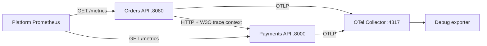

# ReliabilityEngine Observability Suite

[](https://github.com/shashidhar-02/ReliabilityEngine-Observability-Suite/actions/workflows/quality.yml)
[](https://github.com/shashidhar-02/ReliabilityEngine-Observability-Suite/actions/workflows/security-scan.yml)

A reference SRE platform for learning and validating reliability engineering on AWS EKS. Orders (Go) calls Payments (FastAPI), propagates W3C trace context, exposes Prometheus metrics, and exports traces through OpenTelemetry.

## What is implemented

- An actual HTTP Orders → Payments request path with bounded downstream timeouts.
- `/health` and `/metrics` endpoints on both services; checkout and payment request counters and latency histograms.
- Non-blocking trace export and graceful shutdown; fault injection is opt-in.
- Helm deployments with non-root execution, read-only filesystems, probes, resource limits, real service accounts, HPAs, and disruption budgets.
- An OTLP collector with memory limiting, batching, health checks, and two replicas.
- Terraform networking, private EKS, IAM/IRSA, encrypted state configuration, flow logs, and immutable production ECR repositories.
- PR validation, CodeQL, image vulnerability gates, SHA-pinned Actions, grouped OpenTelemetry dependency updates, and explicit cloud deployment workflows.

The collector currently exports to its logs using the `debug` exporter. Durable trace storage, Prometheus/Grafana/Loki installations, paging integrations, dashboards, and deployment freezes remain integration work. This is a production-oriented **reference platform**, not a claim that those systems or a live AWS deployment have already been verified.


```mermaid
flowchart LR
  Orders[Orders API :8080] -->|HTTP + W3C trace context| Payments[Payments API :8000]
  Orders -->|OTLP| Collector[OTel Collector :4317]
  Payments -->|OTLP| Collector
  Collector --> Debug[Debug exporter]
  Prometheus[Platform Prometheus] -->|GET /metrics| Orders
  Prometheus -->|GET /metrics| Payments
```

## Repository layout

| Path | Purpose |
| --- | --- |
| `src/orders-api/` | Go source, tests, container, and Helm chart |
| `src/payments-api/` | Python source, tests, dependencies, container, and Helm chart |
| `k8s-manifests/` | Namespaces, RBAC, network policy, and collector |
| `terraform/env/{prod,staging}/` | Independently validated infrastructure environments |
| `terraform/modules/` | EKS, networking, and IRSA modules |
| `.github/` | Actions, Dependabot, issue templates, PR template |
| `docs/` | Deployment guide, SLOs, ADRs, runbooks |

## Local quick start

Required: Go 1.26, Python 3.11, and optionally Docker, Terraform 1.13.4, Helm 3.17, kubectl, and make for platform checks.

From the repository root:

```bash
python3.11 -m venv .venv
. .venv/bin/activate
python -m pip install --only-binary=:all: --require-hashes -r src/payments-api/requirements-dev.lock
make test PYTHON=python
make lint PYTHON=python
```

Run Payments in one terminal and Orders in another:

```bash
# Terminal 1 (activate .venv first)
cd src/payments-api
uvicorn main:app --host 127.0.0.1 --port 8000
```

```bash
# Terminal 2
cd src/orders-api
PAYMENTS_URL=http://localhost:8000 go run .
```

```bash
curl -X POST http://localhost:8080/checkout \
  -H 'Content-Type: application/json' -d '{}'
curl http://localhost:8080/metrics
curl http://localhost:8000/metrics
```

Payment IDs are synthetic; these sample APIs do not charge money or persist orders. Set `SIMULATE_FAILURES=true` to enable controlled failures in a test process. Set `OTEL_EXPORTER_OTLP_ENDPOINT=http://localhost:4317` when using a local collector. Collector unavailability does not prevent serving requests.

## Checks and deployment

```bash
make format-check
make helm-lint
make validate         # Includes both Terraform environments, no cloud credentials needed
make build            # Requires Docker
make scan             # Requires Trivy; fails on HIGH/CRITICAL vulnerabilities
```

See [`docs/deployment.md`](docs/deployment.md) for state bootstrap, OIDC, ECR imports, EKS authorization, private runners, manual workflows, and rollbacks. Cloud changes are executed explicitly through workflow dispatch, not as a side effect of merging documentation or dependency updates.

| Workflow | Purpose |
| --- | --- |
| `quality.yml` | Go race tests/vet, Python HTTP tests/lint, Terraform validation, Helm/Kustomize validation, container builds/scans, actionlint |
| `security-scan.yml` | PR, main, and nightly vulnerability scans; SARIF reporting where permitted |
| `codeql.yml` | Go/Python static security analysis |
| `apps-deploy.yml` | Validate main, publish immutable ECR images, deploy using a VPC-connected runner |
| `infra-deploy.yml` | Validate, plan, optionally apply the exact plan for staging/prod |

## Contributing

Read [`CONTRIBUTING.md`](CONTRIBUTING.md), use the issue and pull request templates, and follow [`CODE_OF_CONDUCT.md`](CODE_OF_CONDUCT.md). Security reports should use [`SECURITY.md`](SECURITY.md). The architecture and outstanding integrations are documented in [`docs/system-design.md`](docs/system-design.md).

Licensed under Apache 2.0: [`LICENSE`](LICENSE). `LICENSE.txt` is the existing third-party Terraform tooling license notice.
