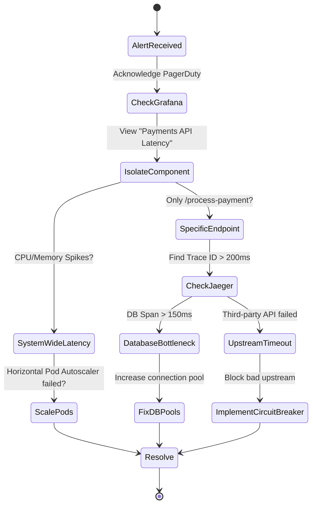

# High Latency Triage Runbook

## Description
This runbook is triggered when the Payments API P95 latency exceeds the **200ms** threshold over a rolling 5-minute window, threatening the monthly Error Budget.

## Triage Workflow Diagram

## Step-by-Step Triage
1. **Acknowledge Alert:** Immediately acknowledge the PagerDuty alert to prevent escalation.
2. **Isolate Component:** Check the Grafana dashboard for the "Payments API" panel. Determine if the latency is isolated to a specific endpoint (e.g., `/process-payment`) or is system-wide.
3. **Trace Analysis (Jaeger):** 
   - Open the Jaeger UI.
   - Filter for traces in the `payments-api` service where `Duration > 200ms`.
   - Inspect the span dependency graph to identify the exact bottleneck (e.g., a slow `SELECT` query or a timed-out external API call).
4. **Resource Verification (Prometheus):** 
   - Check the `kube-state-metrics` dashboards to see if the pods are being CPU-throttled (`container_cpu_cfs_throttled_seconds_total`).
5. **Mitigation Strategies:**
   - **If CPU throttled:** Temporarily increase the CPU limit in `patch-resources.yaml` and rollout the deployment, or trigger the HPA manually.
   - **If DB bound:** Check Postgres/MySQL dashboards for connection pool exhaustion or deadlocks.
   - **If Upstream API bound:** Ensure circuit breakers are functioning properly to fail-fast rather than hanging.
