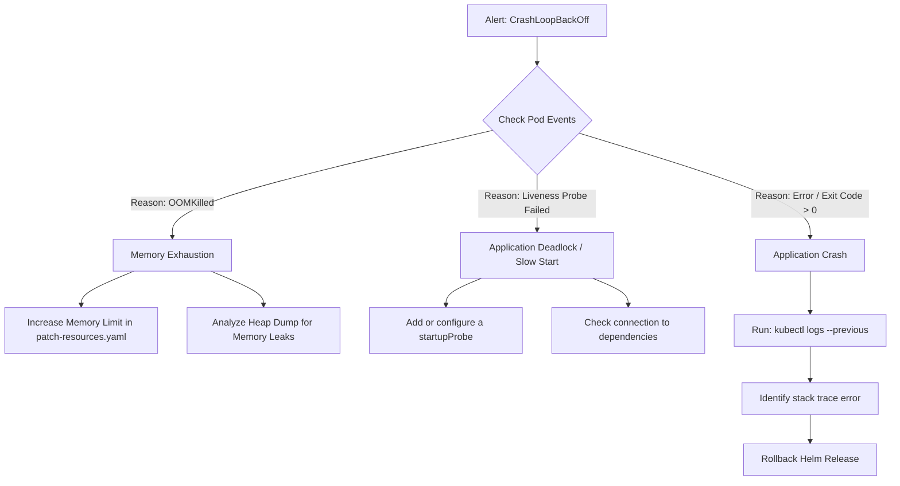

# Pod CrashLoopBackOff Runbook

## Description
This runbook is triggered when a Kubernetes pod enters a `CrashLoopBackOff` state. This indicates the container is starting, immediately crashing, and Kubernetes is attempting to restart it with an exponential backoff delay.

## Debugging Workflow



## Step-by-Step Triage
1. **Identify Failing Pod:** 
   Locate the pod name from the Alertmanager notification or run:
   ```bash
   kubectl get pods -n default | grep CrashLoopBackOff
   ```
2. **Inspect Kubernetes Events:** 
   Determine *why* the kubelet terminated the pod:
   ```bash
   kubectl describe pod <pod-name> -n default
   ```
   Look at the `Last State` under the container specification. If the reason is `OOMKilled`, the application exceeded its memory limits.
3. **Analyze Previous Logs:** 
   Because the pod crashed, current logs might be empty. You must view the logs of the *previous* failed instance to find the stack trace or fatal error:
   ```bash
   kubectl logs <pod-name> --previous -n default
   ```
4. **Mitigation Strategies:**
   - **OOMKilled:** Increase the `resources.limits.memory` in the `k8s-manifests/overlays/prod/patch-resources.yaml`. Check for memory leaks if this occurs frequently.
   - **Application Error (e.g., config panic):** Roll back the deployment to the last known good configuration using Helm:
     ```bash
     helm rollback payments-api 0
     ```
   - **Probe Failures:** If the app takes too long to initialize (e.g., warming caches), add or configure a `startupProbe` in `values.yaml` rather than increasing `initialDelaySeconds` on the `livenessProbe`.
