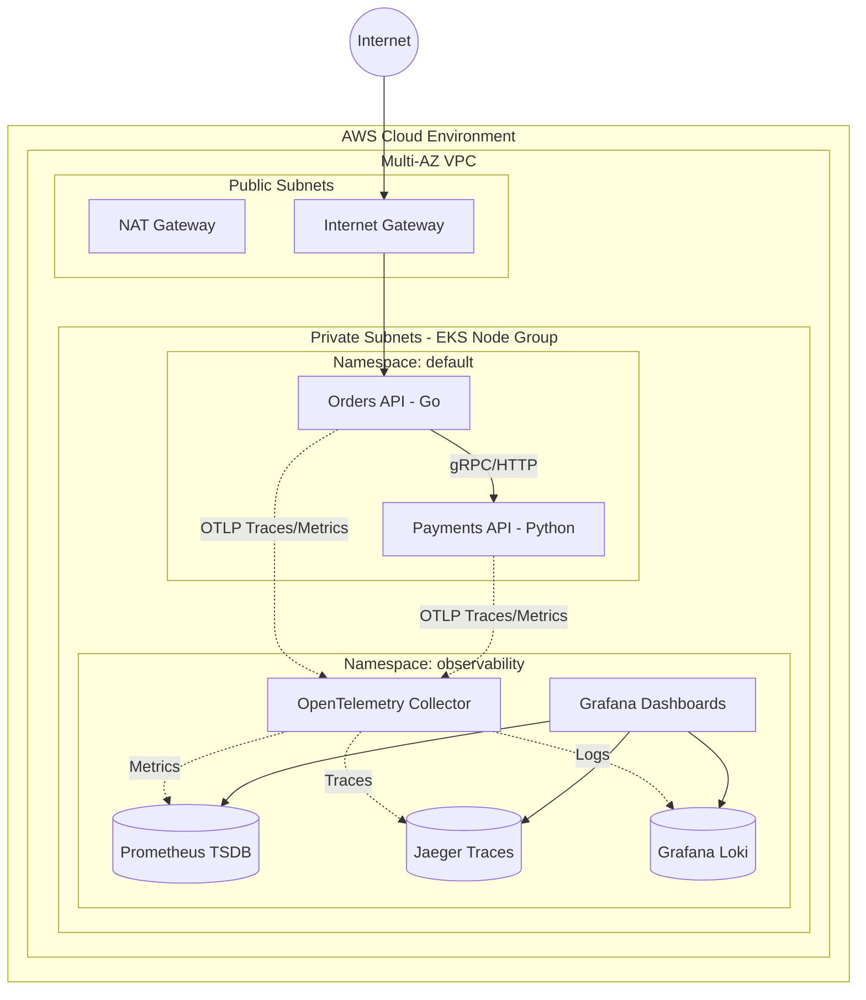

# System Design & Architecture

This document outlines the detailed system design of the Enterprise SRE Observability Platform.

## High-Level Architecture

The platform relies on a decoupled, microservice-based architecture deployed on AWS EKS, utilizing an OpenTelemetry (OTel) pipeline for vendor-agnostic telemetry ingestion.

## Component Details

1. **Microservices (Orders & Payments):** Instrumented using the OpenTelemetry SDKs (`go.opentelemetry.io` and `opentelemetry-instrumentation-fastapi`). They export telemetry data via the OTLP gRPC protocol to the local collector.
2. **OpenTelemetry Collector:** Deployed as a DaemonSet or Deployment in the `observability` namespace. It receives OTLP data, processes it (batching, filtering), and exports it to the specific backends.
3. **Storage Backends:**
   - **Prometheus:** Stores time-series metrics for SLI/SLO tracking and Alertmanager evaluation.
   - **Jaeger:** Stores distributed traces to provide visualizations of microservice dependency graphs and latency bottlenecks.
   - **Loki:** Stores structured JSON logs via Promtail scraping.
4. **Grafana:** The single pane of glass for visualizing all three pillars of observability (Metrics, Logs, Traces) through unified dashboards.
